# Results on Zillow Indoor dataset

References:
- [Zillow Indoor Dataset: Annotated Floor Plans With 360º Panoramas and 3D Room Layouts](https://openaccess.thecvf.com/content/CVPR2021/papers/Cruz_Zillow_Indoor_Dataset_Annotated_Floor_Plans_With_360deg_Panoramas_and_CVPR_2021_paper.pdf)
- [ZInD github](https://github.com/zillow/zind)


## Dataset preparation
- Visit [ZInD](https://github.com/zillow/zind) to get the datas.
    - Also download the official split `zind_partition.json`.
- Run below to extract the rgb and layout to support HorizonNet training and evaluation.
    ```bash
    python misc/zind_prepare_dataset.py --partition {PATH_TO}/zind_partition.json --indir {PATH_TO_DATA_ROOT} --outdir data/zind_horizonnet/
    ```
  Add `-h` to see more option. The default setting extract only `layout_visible`, `is_primary`, `is_inside`, `is_ceiling_flat`.


## Training
```bash
python train.py --train_root_dir data/zind_horizonnet/train/ --valid_root_dir data/zind_horizonnet/val/ --id resnet50_rnn__zind --epochs 50
```
See `python train.py -h` or [README.md#training](https://github.com/sunset1995/HorizonNet#training) for more detail.

Download the trained model: [resnet50_rnn__zind.pth](https://drive.google.com/open?id=16v1nhL9C2VZX-qQpikCsS6LiMJn3q6gO).
- Trained on Zillow Indoor 20077 images with default data extraction setup.
- Trained for 50 epoch.


## Restuls

### Testing
```bash
python inference.py --pth ckpt/resnet50_rnn__zind.pth --img_glob "data/zind_horizonnet/test/img/*" --output_dir ./output/zind/resnet50_rnn_post/ --visualize
python inference.py --pth ckpt/resnet50_rnn__zind.pth --img_glob "data/zind_horizonnet/test/img/*" --output_dir ./output/zind/resnet50_rnn_nopost/ --visualize --force_raw
```
- `--output_dir`: A directory you want to dump the extracted layout.
- `--visualize`: Visualize raw output from HorizonNet.
- `--force_raw`: Disable post-processing, export raw output as `1024*2` vertices polygon instead.

### Quantitative evaluation
```bash
python eval_general.py --dt_glob "./output/zind/resnet50_rnn_post/*" --gt_glob "data/zind_horizonnet/test/label_cor/*"
python eval_general.py --dt_glob "./output/zind/resnet50_rnn_nopost/*" --gt_glob "data/zind_horizonnet/test/label_cor/*"
```

:clipboard: Below is the quantitative result on Zillow Indoor testing set.

#### 2D IoU
|          | all    | 4     | 6     | 8     | 10+   | odd   |
|----------|--------|-------|-------|-------|-------|-------|
| w post   | 68.48  | 79.31 | 75.20 | 70.80 | 56.70 | 58.25 |
| w/o post | 89.80  | 94.13 | 93.56 | 91.31 | 84.36 | 85.59 |

#### 3D IoU
|          | all    | 4     | 6     | 8     | 10+   | odd   |
|----------|--------|-------|-------|-------|-------|-------|
| w post   | 67.52  | 78.23 | 74.28 | 69.96 | 55.85 | 57.32 |
| w/o post | 88.47  | 92.83 | 92.32 | 90.06 | 83.03 | 84.15 |

#### Conclusion
We find that current post-processing fails on Zillow Indoor dataset.
A new algorithm to rectify model's raw output (i.e., polygon w/ `1024*2` vertices) to Manhattan layout is required.


### Qualitative results

We visualize model raw output on Zillow Indoor testset.
We also compare with the results from a HorizonNet trained only on Structured3D dataset.

#### Different layout definition
Whether to reconstruct the boundary out of current camera position is application dependent.

| Trained only on Structured3D | Trained on Zillow Indoor |
|:--:|:--:|
|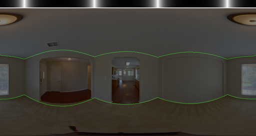|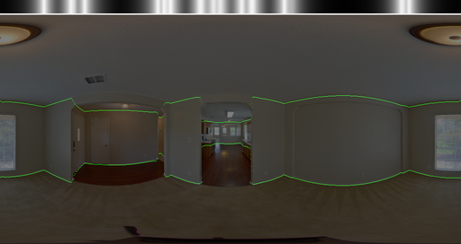|
|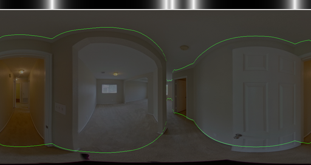|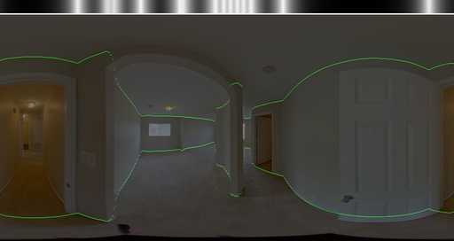|
|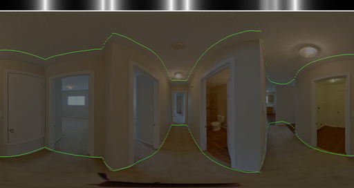|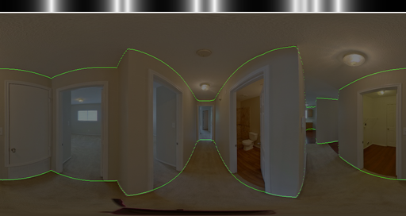|
|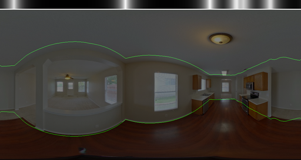|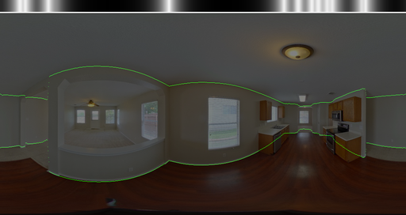|
|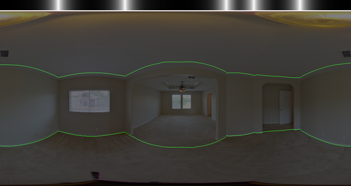|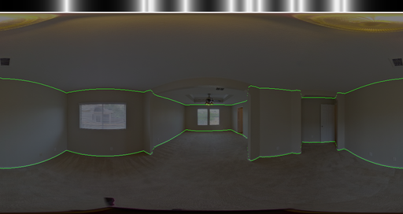|
|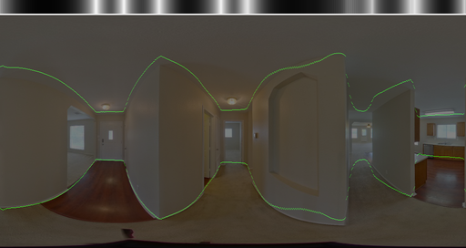|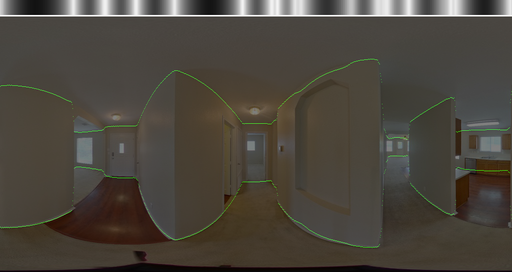|
|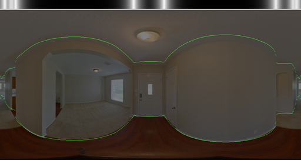|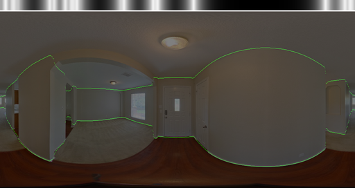|


#### Domain gap?
Probably solvable by domain adaptation in future work.

| Trained only on Structured3D | Trained on Zillow Indoor |
|:--:|:--:|
|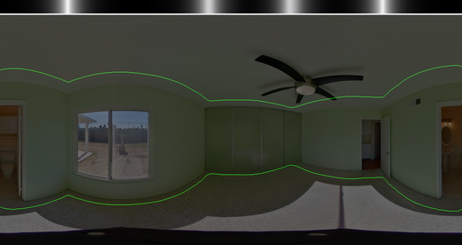|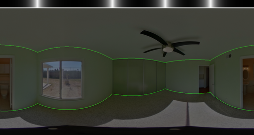|
|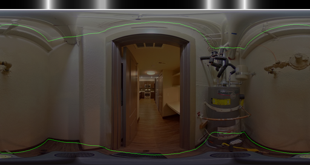|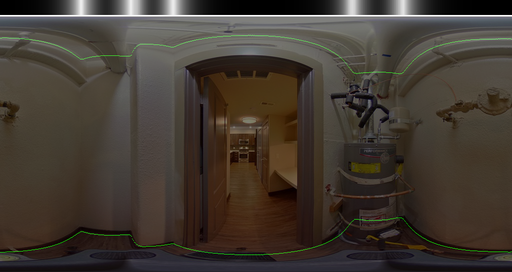|
|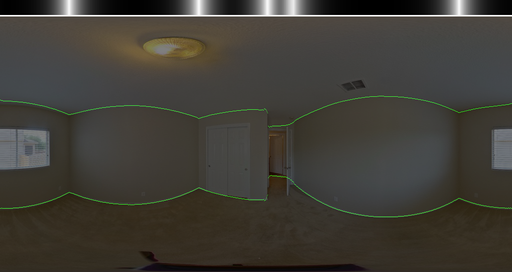||
|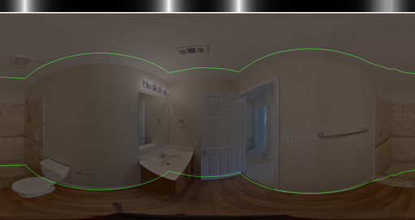|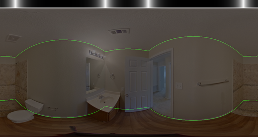|
|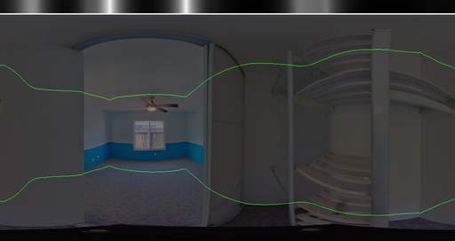|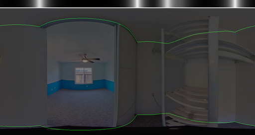|

